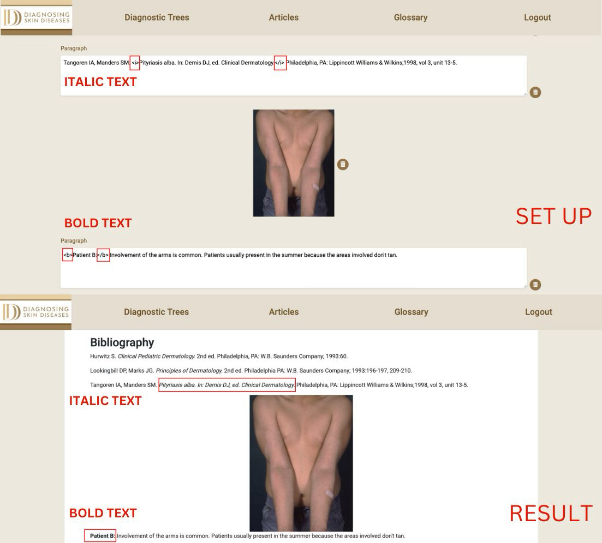
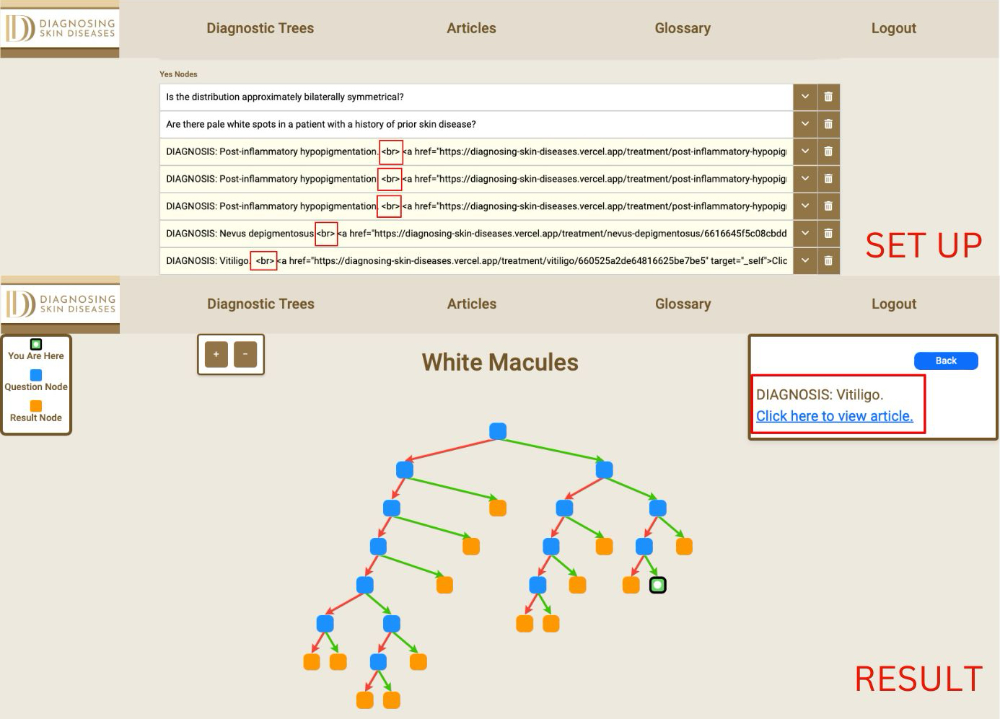

### Formatting Text

- **Bold Text:** Use the `<b>` tag to make text bold.
  - Example: `<b>bold text</b>`
- **Italic Text:** Use the `<i>` tag to italicize text.
  - Example: `<i>italic text</i>`

- **New Line:** Use the ` ` tag to insert a new line in the text.
  - Example: `This is the first line. This is the second line.`
