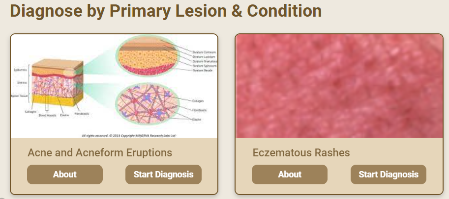
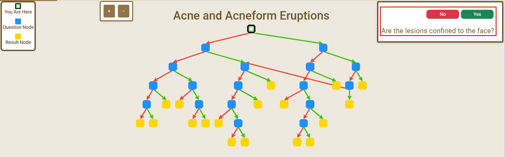
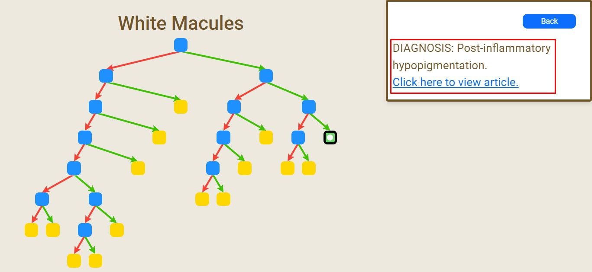

# Task 1: How To Diagnose Skin Diseases

For diagnosing skin diseases, follow these steps:

1. From the landing page, pre-loaded skin condition cards are displayed. These trees are designed to help you diagnose specific skin conditions. **Click** _Start Diagnosis_\*\* on the diagnostic tree card that corresponds to the skin condition you want to diagnose.

[!TIP]
You can also access the diagnostic tree page by **Clicking** on the **Diagnostic Tree** button in the navigation bar from any page.

2. At the top right hand corner, answer the diagnostic questions by **Clicking** on the _YES_ or _NO_ buttons. Based on your responses, the tree will guide you to the next question.

3. Continue answering questions until you reach the final diagnosis. The tree will provide a diagnosis and recommended treatment based on your responses.

[!TIP]
You can also move to the previous question by **Clicking** on the _Back_ button.

4. When you reach the final diagnosis displayed as a yellow node, the tree will either provide a diagnosis and link you an article related to the skin condition or tell you to refer to a dermatologist. If there is a skin condition, you can also **Click** on the _Click here to view article_ link to read more about the skin condition.

> [!IMPORTANT]
> Ensure you answer each question accurately to receive an accurate diagnosis.
