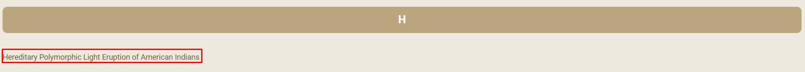
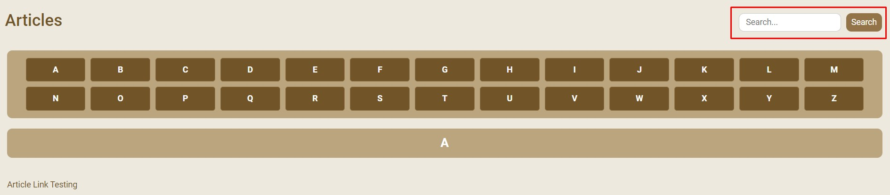
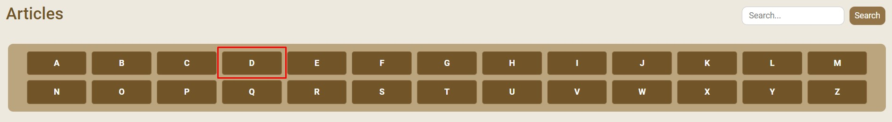

# Task 2: Accessing the Articles Page

1. To view additional information on different skin diseases, **Click** on the **Articles** button in the navigation bar. This will direct you to the articles page where you can access detailed information on skin diseases and treatments.

2. Articles will be presented in a list format and sorted in alphabetical order. **Click** on the article you want to read to view the full content.

> [!NOTE]

3. Alternatively, you can use the search bar to find articles on specific skin diseases. **Enter** the name of the skin disease you want to search for in the search bar and **Click** the search icon.

4. The search results will display articles related to the skin disease you searched for. **Click** on the article you want to read to view the full content.

> [!NOTE]

5. You can also only view the articles with a certain letter by **Clicking** on the corresponding letter in the alphabetical selector near the top of the page.

6. The search results will display articles related to the alphabet letter you have selected. **Click** on the article you want to read to view the full content.
