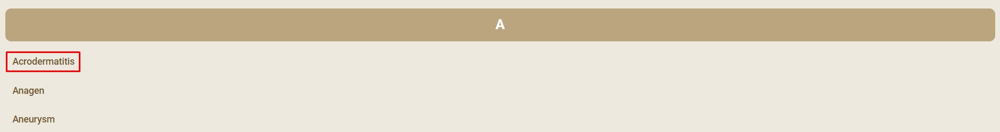
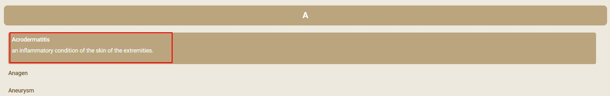
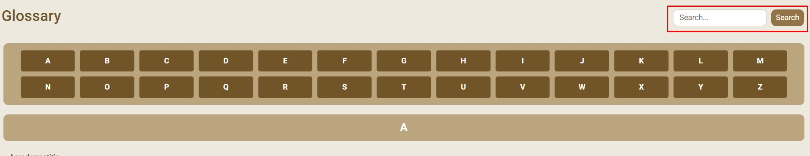
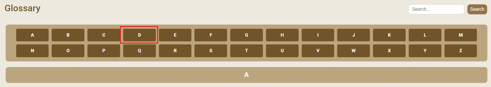

# Task 2: Accessing the Glossary Page

1. To access definitions of terms related to skin diseases, **Click** on the **Glossary** button in the navigation bar.

1. To access definitions of terms related to skin diseases, on different skin diseases, **Click** on the **Glossary** button in the navigation bar. This will direct you to the glossary page where you can find explanations for various terms used in the application.

1. The glossary will be presented in a list format and sorted in alphabetical order. **Click** on the glossary term you want to read to view the full content.

2. The glossary term will be expanded and provides a definition of the term. You can also **Click** on the glossary term to collapse the definition.

> [!NOTE]

3. Alternatively, you can use the search bar to find a specific glossary term. **Enter** the name of the term you want to search for in the search bar and **Click** the search icon.

4. The search results will display the term you searched for. **Click** on the glossary term to read its definition.

> [!NOTE]

5. You can also only view certain terms with a certain starting letter by **Clicking** on the corresponding letter in the alphabetical selector near the top of the page.

6. The search results will display glossary terms with the starting alphabet letter you have selected. **Click** on the term you want to read to view its definition
